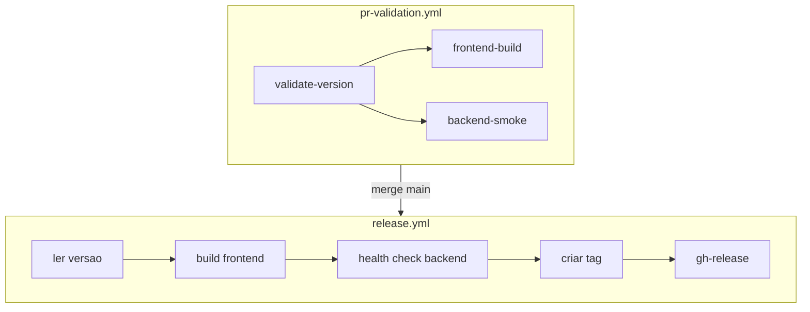

# Plano: melhorias GitHub Actions (escopo aprovado)

Documento salvo para implementação futura. Itens escolhidos em relação ao plano completo.

**Arquivos alvo:** [pr-validation.yml](workflows/pr-validation.yml), [release.yml](workflows/release.yml)

---

## Escopo aprovado

| # | Item | Decisão |
|---|------|---------|
| 1 | Health check do backend robusto | **Incluir** |
| 3 | Validação no release antes de publicar | **Opção A** — duplicar steps de build + health check em `release.yml` (sem reusable workflow) |
| 5 | Jobs paralelos na PR | **Incluir** |
| 8 | Cache npm no release | **Incluir** |
| 10 | Pin de actions por SHA | **Incluir** |

## Fora do escopo (por enquanto)

- Release idempotente quando tag já existe (#2)
- Reusable workflow (#3 opção B)
- `concurrency` e `paths` (#6, #7)
- Script centralizado de versão (#9)
- Testes Supertest/Jest, lint, artefatos (#11–13)
- Alinhamento de versão backend/frontend (#14)
- Simplificar criação de tag (#15)
- Dependabot, CODEOWNERS, environments (#16 e governança)

---

## Arquitetura alvo



---

## 1. Health check robusto (PR e depois release)

**Problema:** `sleep 5` + `curl` sem `-f` — flaky e não falha em HTTP de erro.

**Alterar** o step `Testar backend` em `pr-validation.yml`:

```yaml
- name: Testar backend
  run: |
    for i in $(seq 1 30); do
      if curl -sf http://localhost:3333/ | grep -q 'API funcionando'; then
        exit 0
      fi
      sleep 1
    done
    echo "Backend não respondeu a tempo"
    exit 1
```

Reutilizar o mesmo bloco (ou equivalente) em `release.yml` após o item 3.

---

## 3A. Build + smoke test no release

**Problema:** `release.yml` só lê versão, cria tag e release — não garante que o código na `main` compila/roda.

**Adicionar em** `release.yml`, **antes** de criar tag:

1. `actions/setup-node@v4` com `node-version: 22` e cache (item 8)
2. `npm ci` + `npm run build` em `frontend/`
3. `npm ci` em `backend/`
4. Iniciar backend em background (`node src/server.js &`)
5. Health check (item 1)

Ordem final sugerida dos steps no job `release`:

1. checkout  
2. setup-node (com cache)  
3. ler versão  
4. verificar se tag existe (comportamento atual — falha se duplicada)  
5. build frontend  
6. instalar backend + iniciar + health check  
7. criar tag  
8. criar release (`softprops/action-gh-release`)

---

## 5. Jobs paralelos na PR

**Problema:** um único job `validate` roda versão → frontend → backend em série.

**Estrutura alvo** em `pr-validation.yml`:

```yaml
jobs:
  validate-version:
    name: Validate Version
    runs-on: ubuntu-latest
    timeout-minutes: 5
    steps:
      # checkout fetch-depth: 0
      # setup-node (sem cache necessário para só ler package.json)
      # step "Validar versão do sistema" (inalterado em lógica)

  frontend:
    name: Build Frontend
    needs: validate-version
    runs-on: ubuntu-latest
    timeout-minutes: 5
    steps:
      # checkout, setup-node com cache
      # npm ci + npm run build em frontend/

  backend:
    name: Smoke Test Backend
    needs: validate-version
    runs-on: ubuntu-latest
    timeout-minutes: 5
    steps:
      # checkout, setup-node com cache
      # npm ci backend, iniciar servidor, health check (item 1)
```

**Branch protection:** atualizar required checks para os **três** job names (ou um único check agregado se o GitHub exigir todos os jobs da workflow — por padrão, marcar os três jobs como required).

---

## 8. Cache npm no release

Espelhar a configuração da PR:

```yaml
- uses: actions/setup-node@v4
  with:
    node-version: 22
    cache: npm
    cache-dependency-path: |
      frontend/package-lock.json
      backend/package-lock.json
```

Necessário porque o release passará a rodar `npm ci` nos dois pacotes.

---

## 10. Pin de actions por SHA

Substituir tags móveis (`@v4`, `@v2`) por commit SHA completo. Exemplo (confirmar SHA atual no momento da implementação):

| Action | Tag atual | Ação |
|--------|-----------|------|
| `actions/checkout` | v4 | Pin SHA + comentário com versão |
| `actions/setup-node` | v4 | Pin SHA |
| `softprops/action-gh-release` | v2 | Pin SHA |

Documentar no topo de cada workflow a data da última atualização dos SHAs. Opcional depois: Dependabot `package-ecosystem: github-actions`.

---

## Ordem de implementação

1. **#1** — health check na PR (mudança pequena, valida o padrão).  
2. **#5** — refatorar PR em 3 jobs (mover steps, manter lógica).  
3. **#3A + #8** — estender `release.yml` com setup-node, cache, build e smoke.  
4. **#10** — pin SHA em ambos os workflows (diff limpo no final).

---

## Checklist pós-implementação

- [ ] PR com bump de versão: 3 jobs verdes  
- [ ] PR sem mudança de código (só docs): jobs ainda rodam (paths não estão no escopo)  
- [ ] Merge na `main` com versão nova: release faz build + smoke antes da tag  
- [ ] Merge na `main` sem bump: release falha na tag duplicada (comportamento atual mantido)  
- [ ] Branch protection aponta para os novos nomes de jobs  

---

## Referência rápida — estado atual

- Versão: só `frontend/package.json`  
- Backend smoke: porta `3333`, rota `GET /` retorna JSON com `API funcionando`  
- Release: não valida app hoje; só tag + GitHub Release  

*Última revisão do escopo: maio/2026*
